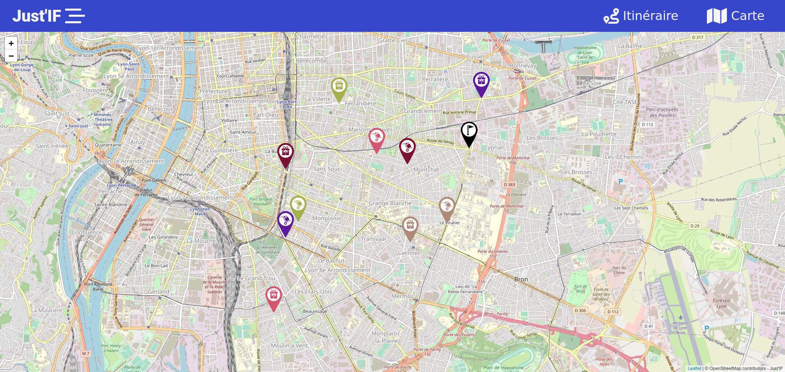
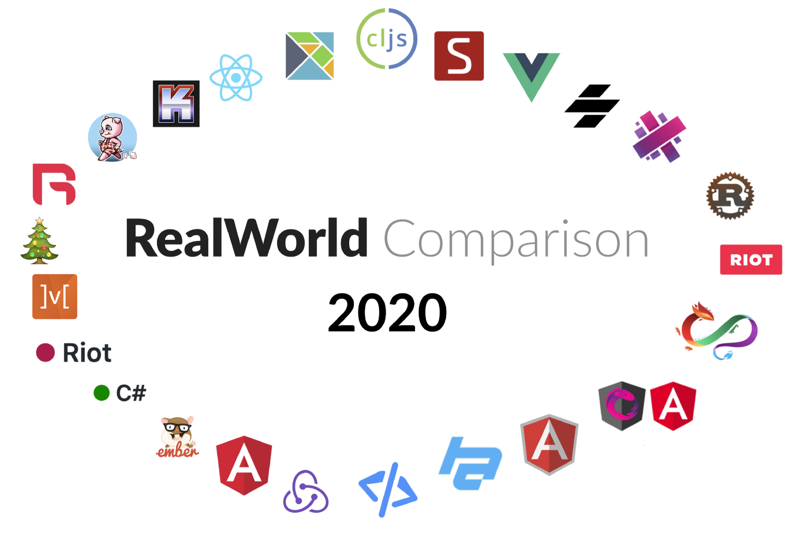

            
    &nbsp; &nbsp; &nbsp;
    

# 4IFA - PLD Agile - Frontend

Ce projet a été réalisé dans le cadre du PLD Agile. L'équipe est constitué de 5 membres organisés dans une démarche Agile. La durée totale du projet est de 4 semaines, organisées en 4 sprint de une semaine.

L'objectif du projet est de concevoir et développer une application permettant de préparer des tournées de livraison optimisées.

Plus précisement, à partir de l'IHM, il est possible de :
- Charger un plan à partir d'un fichier XML
- Visualiser et intéragir avec le plan 
- Charger un programme de Pickup&Delivery à partir d'un fichier XML
- Visualiser les différents points de livraisons et chargement du programme

# Réalisation

L'application a été développée avec **Svelte v3** et utilise notamment **Leaflet** pour l'affichage et la gestion de la carte.

    

### Ouvrir l'IHM en local

Pour créer le paquet final de l’IHM, il faut au préalable télécharger les dépendances avec la commande `npm install`. 

Ensuite, il faut exécuter la commande `npm run build`, qui produit un répertoire `build`, situé dans le répertoire `public`. 

L’IHM est alors disponible en ouvrant le fichier `index.html` situé dans le répertoire `public`.

Le répertoire `public` représente le paquet final de l'application, c'est celui-ci qu'il faut transmettre aux clients ou déployer sur un serveur. 

# Svelte

**Svelte est un framework Javascript, plus précisément un "compilateur front" offrant un JS performant, natif, réactif et léger.**

Ses principales caractéristiques sont les suivantes :
- **Compilation** du code au moment de la construction
- Fractionnement efficace et simple du code : approche par **composant**
- Composants constitués de code **HTML, CSS et JS** simple
- **Intégration** de CSS dans le composant lui-même
- Une **syntaxe** simplifiant l’écriture du code
- **Pas de DOM Virtuel**, composants **réactifs**
- Taille **faible** du paquet de l’application

**L'objectif : des performances accrues, un poids final réduit, le tout avec moins de code**

_Retrouvez toute la documentation du framework ici : **[svelte.dev/](https://svelte.dev/)**_

_Un point d'entrée pour apprendre le framework ici : **[svelte.dev/tutorial/basics](https://svelte.dev/tutorial/basics)**_

# Choix du Framework

Svelte est un écosystème jeune en **évolution**, qui suscite suffisamment d'intérêt pour être utilisé par le **New York Times, Spotify, IBM, Rakuten, ...**

La communauté autour de Svelte est **grandissante** et c'est un framework qui a le mérite d'être suivi.

De nombreux articles mettent en avant le framework et le confronte aux leaders du marché comme **Angular, Vue, React, ...**

C'est pourquoi, il nous a semblé pertinent de profiter de ce cours pour élargir nos compétences techniques avec un Framework en vogue prometteur.

Par ailleurs, un **Hands-on-lab** de 3 heures sur Svelte est présenté au **Devoxx France 2022** : **[plus d'information ici](https://cfp.devoxx.fr/2022/talk/QWC-2883/_Devenir_svelte_avec_Svelte)**

### RealWorld Project

Selon **[cet article medium](https://medium.com/dailyjs/a-realworld-comparison-of-front-end-frameworks-2020-4e50655fe4c1)**, il ressort que Svelte est un framework performant, léger et simple.

Les données sont issues d'un **RealWorld Project**, ou l'idée est de confronter de nombreux frameworks frontend, implémentant les mêmes spécifications.

Le projet, **open source**, est sous licence du **MIT** et est disponible ici : **[github.com/gothinkster/realworld](https://github.com/gothinkster/realworld)**

## Pour aller plus loin

Différentes ressources sur Svelte :
- [Svelte, solution pour applications web rapides : _asi.fr_](https://www.asi.fr/blog/sveltejs-solution-pour-applications-web-rapides)
- [Svelte : un concurrent de poids face à React-Vue-Angular ? : _medium.com_](https://medium.com/codeshake/svelte-un-concurrent-de-poids-face-%C3%A0-react-vue-angular-ca6b41a23d7)
- [React vs Vue vs Angular vs Svelte : _dev.to_](https://dev.to/hb/react-vs-vue-vs-angular-vs-svelte-1fdm)
- [Svelte vs Vue: Top Front-End Frameworks Comparison : _procoders.tech_](https://procoders.tech/blog/svelte-vs-vue-frameworks-comparison/)
- [Results for js web frameworks benchmark : _stefankrause.net_](https://stefankrause.net/js-frameworks-benchmark8/table.html)
